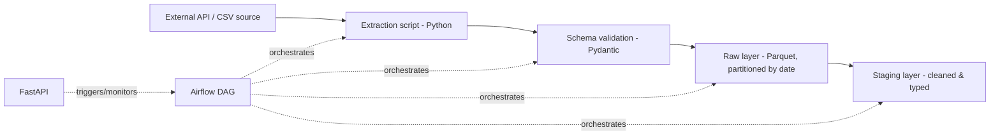

# Batch Data Ingestion Pipeline

## Overview

A batch pipeline that extracts data from a public API and/or CSV sources, validates it against a schema, and lands it in
a partitioned raw storage layer — fully orchestrated with Airflow.

## Architecture

## Tech Stack
- Python 
- Pydantic
- Parquet
- Airflow
- FastAPI (trigger/metadata endpoint only)

